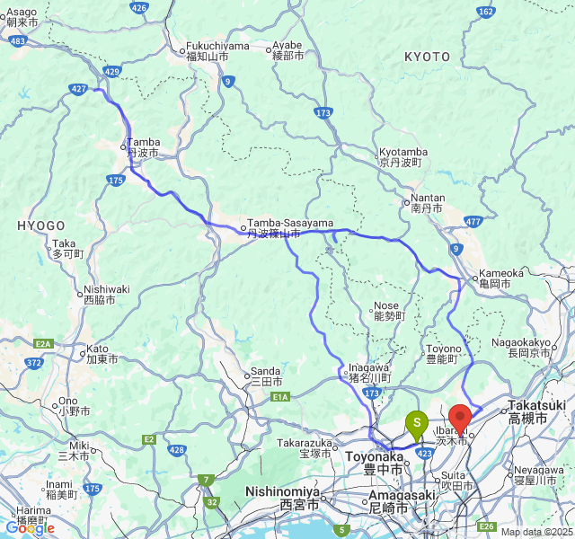

# n8n-nodes-ride

> **⚠️ BREAKING CHANGE NOTICE - Version 0.2.1**
> 
> **Important for existing users**: Version 0.2.1 introduces breaking changes to track point data format.
> 
> **What changed:**
> - Route and Trip track points now use readable property names instead of single letters
> - **Before v0.2.1**: `{x: longitude, y: latitude, e: elevation, t: timestamp, s: speed, h: heartRate, c: cadence}`  
> - **After v0.2.1**: `{longitude, latitude, elevation, timestamp, speed, heartRate, cadence}`
> 
> **Why this change?** This breaking change significantly improves user experience and workflow readability. Single-letter property names (`x`, `y`, `e`) are confusing and error-prone. We made this change now while the community is still growing to minimize long-term disruption and provide a better foundation for future users.
> 
> **Action required:** If your workflows access track point data (e.g., `trip.track_points[0].x`), you must update them to use the new property names (e.g., `trip.track_points[0].longitude`).
> 
> **Migration example:**
> ```javascript
> // OLD (v0.2.0 and earlier)
> const lat = trip.track_points[0].y;
> const lng = trip.track_points[0].x;
> 
> // NEW (v0.2.1+)  
> const lat = trip.track_points[0].latitude;
> const lng = trip.track_points[0].longitude;
> ```

This is an n8n community node. It lets you use Ride with GPS in your n8n workflows.

Ride with GPS is a comprehensive cycling platform that allows users to plan routes, track rides, organize events, and share their cycling adventures with a community of riders.

[n8n](https://n8n.io/) is a [fair-code licensed](https://docs.n8n.io/reference/license/) workflow automation platform.

[Installation](#installation)  
[Operations](#operations)  
[Credentials](#credentials)  
[Compatibility](#compatibility)  
[Usage](#usage)  
[Resources](#resources)  

## Installation

Follow the [installation guide](https://docs.n8n.io/integrations/community-nodes/installation/) in the n8n community nodes documentation.

## Operations

This node supports the following resources and operations:

### User
- **Get Current**: Retrieve information about the currently authenticated user

### Events
- **Get Event**: Retrieve details of a specific event by ID (including associated routes and organizer info)
- **Get Events**: Retrieve a paginated list of events owned by the authenticated user

### Routes
- **Get Route**: Retrieve details of a specific route by ID (including track points, course points, and points of interest)
- **Get Routes**: Retrieve a paginated list of routes owned by the authenticated user

### Trips
- **Get Trip**: Retrieve details of a specific trip by ID (including track points and comprehensive trip statistics)
  - **Multiple Output Formats**: Choose from Data, KML, and Image formats (multiple selections allowed)
  - **Image Generation**: Create static map images using Google Maps Static API (optional feature)
- **Get Trips**: Retrieve a paginated list of trips owned by the authenticated user

### Sync
- **Sync**: Retrieve changes to routes and/or trips since a specific datetime (specialized for data synchronization)

## Credentials

To use this node, you need to authenticate with Ride with GPS using your service account credentials.

### Prerequisites
1. Sign up for a [Ride with GPS account](https://ridewithgps.com)

### Authentication Setup
1. In n8n, create new credentials of type "Ride API"
2. Enter your Ride with GPS service account email address and password
3. **Optional**: Enter your Google Maps API key for static map image generation
   - This is only required if you want to use the Image output format for trips
   - You can use all other features without a Google Maps API key
4. Configure the base URL (defaults to `https://ridewithgps.com`)

### Google Maps API Setup (Optional)
To use the static map image generation feature:
1. Get a Google Maps API key from the [Google Cloud Console](https://console.cloud.google.com/)
2. Enable the "Maps Static API" for your project
3. Add the API key to your Ride API credentials in n8n
4. **Note**: This is completely optional - all other node features work without it

## Compatibility

- **Minimum n8n version**: 1.0.0
- **Node.js version**: 20.15 or higher
- **Tested with**: n8n v1.x

## Usage

### Basic Examples

**Get Current User Information:**
- Select Resource: User
- The node will automatically fetch the current user's profile information

**List Your Routes:**
- Select Resource: Routes
- Select Operation: Get Routes
- Optionally specify a page number for pagination

**Get Specific Route Details:**
- Select Resource: Routes  
- Select Operation: Get Route
- Enter the Route ID

**Get Trip with Multiple Output Formats:**
- Select Resource: Trips
- Select Operation: Get Trip  
- Enter the Trip ID
- Select Output Formats: Choose any combination of Data, KML, and/or Image
- **Image Format**: Creates a static map showing the trip route with start/end markers
  - Requires Google Maps API key in credentials
  - Generates n8n-compatible binary data for easy use with other nodes


*Example of generated static map showing trip route with start (S) and end (E) markers*

**Sync Changes:**
- Select Resource: Sync
- Enter a "Since Datetime" in ISO8601 format (e.g., `2024-01-01T00:00:00Z`)
- Select Asset Types (Routes, Trips, or both)
- This is useful for maintaining synchronized copies of user data

### Pagination
Most list operations support pagination through the "Page Number" parameter. The response will include metadata about pagination, including total record count and links to additional pages.

### Data Synchronization
The Sync operation is particularly useful for:
- Initial full synchronization (use `1970-01-01T00:00:00Z` as since datetime)
- Incremental updates (use the timestamp from previous sync)
- Maintaining backup copies of user's route and trip libraries

## Changelog

### Version 0.2.1 (Latest)
- **📊 Readable Track Points**: Route and Trip track points are now automatically converted to readable property names
  - **Route Track Points**: API format `{x, y, e}` → Readable format `{longitude, latitude, elevation}`
  - **Trip Track Points**: API format `{x, y, e, t, s, h, c}` → Readable format `{longitude, latitude, elevation, timestamp, speed, heartRate, cadence}`
  - **Immediate Conversion**: Transformation occurs immediately upon API response reception
- **🚀 Performance Optimization**: Routes list responses skip unnecessary track point transformation
  - Routes list API responses don't include track points, so transformation is optimized to avoid wasteful processing
  - Individual route details still receive full track point transformation when present
- **🔧 Enhanced Data Processing**: Added comprehensive transformation functions in `utils/dataTransformer.ts`
  - `transformAPIRouteTrackPoint()` and related functions for Route track points
  - Maintained existing Trip transformation functions for consistency
- **📈 Improved Developer Experience**: Track point data is now more intuitive to work with in workflows
  - No need to remember that 'x' means longitude or 'y' means latitude
  - Self-documenting property names improve workflow readability

### Version 0.2.0
- **🎯 Multiple Output Formats**: Trip retrieval now supports multiple simultaneous output formats
  - **Data**: Original JSON trip data 
  - **KML**: GPS/mapping application compatible format
  - **Image**: Static map visualization using Google Maps Static API
- **🖼️ Static Map Generation**: New image output format creates visual trip representations
  - Shows complete trip route with start (S) and end (E) markers
  - Optimized for up to 200 coordinate points for detailed route display
  - Returns n8n-compatible binary data for easy integration with other nodes
  - See example image in [Usage section](#usage)
- **🔐 Google Maps Integration**: Optional Google Maps API key support
  - Add API key to existing Ride API credentials (completely optional)
  - Only required for Image output format
  - All existing features continue to work without Google Maps API key
- **💡 Enhanced Flexibility**: Choose any combination of output formats in a single request
  - Generate multiple outputs (e.g., Data + KML + Image) from one trip fetch
  - Each output includes `output_format` identifier for easy processing
- **⚠️ Smart Validation**: Automatic validation prevents Image selection without API key

### Version 0.1.4
- **Authentication Update**: Changed from API key to service account email/password authentication

### Version 0.1.3
- Experimental features (reverted in 0.1.4)

### Version 0.1.2
- Added KML conversion functionality for trip data
- Improved error handling and validation

### Version 0.1.1
- Initial release with basic Ride with GPS API integration
- Support for User, Events, Routes, Trips, and Sync operations

## Resources

* [n8n community nodes documentation](https://docs.n8n.io/integrations/#community-nodes)
* [Ride with GPS API Documentation](https://ridewithgps.com/api)
* [Ride with GPS Platform](https://ridewithgps.com)

## License

This project is licensed under the MIT License.
